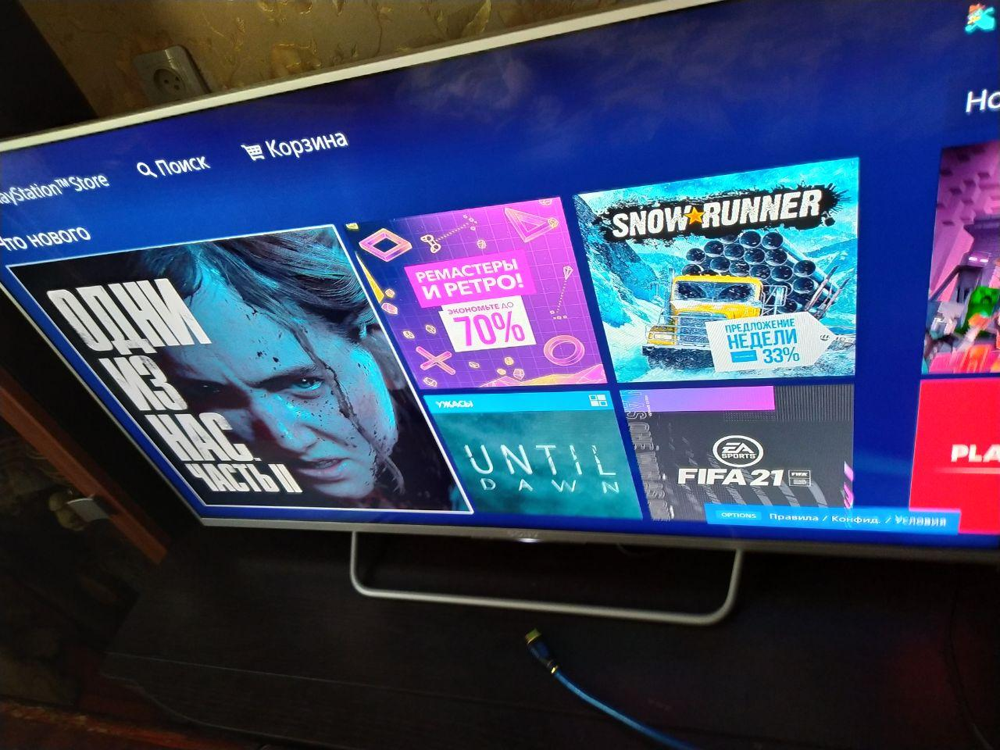

# Задание
Промо-пейдж для магазина игр на основе PlayStation Store

## Цель
Сделать страницу с 5 играми. Ниже изображено представление будущей страницы на примере PlayStation Store



Каждую отдельную игру можно выбрать и посмотреть полное описание, пример которого можно увидеть ниже.


Страница игры будет сильно упрощена и сведена к доступным данным из БД.

## Термины
**Превью** - равносторонний квадрат с изображением игры

**Промо-пейдж** - первая страница с блочным списком игр

**Дисклеймер** - частичное упоминание ограниченных прав на пользование контентом

**Референс** - ссылка на файл в теге `head`

## Критерии выполнения
#### Общие критерии
* Реализация доступа к базе данных должна быть скрыта от исполнителя. Открывать файл `games.js` не разрешается.
* Хидер должен содержать название магазина. Название обсуждается с дизайн менеджером.
* Футер содержит имя правообладателя и нынешний год 


#### Страница 1, превью игр
* Футер и хидер выбранного цвета (варианты палитры согласовать с дизайн менеджером)
* Блочный список из 5 игр, каждую из которых можно просмотреть подробнее на второй странице
* При наведении на одну из игр снизу квадрата превью всплывает полупрозрачный синий прямоугольный блок с названием игры и ценой
  * Высота всплывающего блока на всех превью одинаковая и не должна превышать 20% от высоты превью
  * Прозрачность блока не выше 60%
  * Название игры расположено слева
  * Цена справа 
* При нажатии на одну из игр открывается [страница 2](#страница-2,-описание)


#### Страница 2, описание
  * Более полное описание игры со всеми доступными деталями
  * Слева расположен превью с изображением игры
  * Под превью большим шрифтом цена
  * Чуть ниже под ценой вес игры в Гигабайтах
  * Справа от него большим шрифтом название игры
  * Ниже расположен неизменяемый текст с названием компании производителя (неизменный) и версии игры (всегда полная версия игры)
  * Ниже описание игры
  * Под описанием игры идет неотъемлемая часть с [дисклеймером](#приложение-1---дисклеймер)

## Приложения
### Приложение 1 - дисклеймер
```
Загрузка осуществляется в соответствии с Условиями обслуживания PlayStation Network, Условиями использования программ и любыми другими применимыми дополнительными документами. Если вы не согласны выполнять условия, не загружайте материалы. Дополнительная информация приведена в Условиях обслуживания.
Разовая лицензионная плата за право загрузки на несколько систем PS4. Вход в PlayStation Network не требуется при использовании на вашей основной системе PS4, но необходим при использовании на других системах PS4.
Перед использованием продукта ознакомьтесь с «Мерами предосторожности», важными для вашего здоровья.
Библиотечные программы ©Sony Interactive Entertainment Inc., эксклюзивно лицензированы Sony Interactive Entertainment Europe. Действуют Условия использования программ. Полный текст Условий использования см. на сайте ru.playstation.com/legal.
```
### Приложение 2 - база данных
Схема базы данных с описанием каждого свойства показана ниже.

Доступ к базе данных осуществляется через COM объект `games`. Для его использования необходимо добавить референс на файл `scripts\games.js`